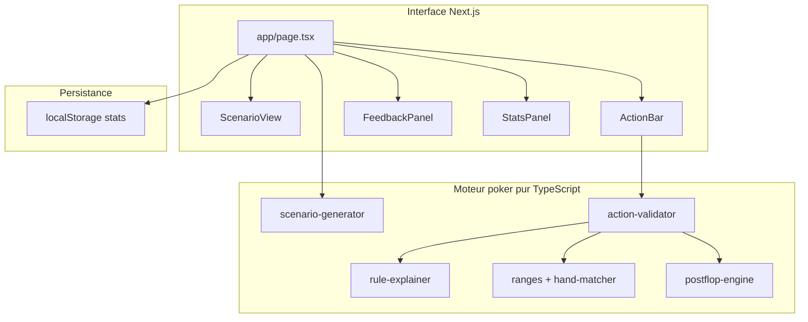
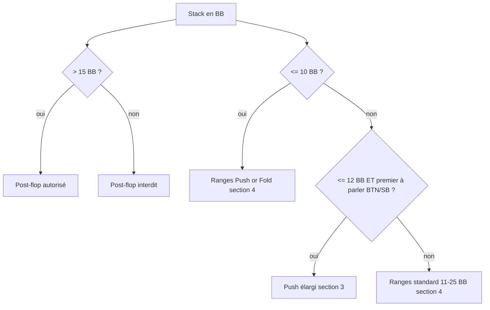

# Plan — Poker Trainer Spin & Go (3-Max Hyper-Turbo)

## Contexte

Le workspace [`/Users/alexandre-pascal/Documents/Projets/poker-trainer`](/Users/alexandre-pascal/Documents/Projets/poker-trainer) est **vide**. On part de zéro avec `create-next-app` (App Router, TypeScript, Tailwind, ESLint).

## Architecture globale



Le moteur poker vit dans `src/lib/poker/` (fonctions pures, sans React) pour être testable avec **Vitest**.

---

## 1. Bootstrap du projet

- Initialiser Next.js 15+ dans le dossier racine
- Installer **shadcn/ui** (Button, Card, Badge, Progress, Toast) pour une UI claire et cohérente
- Configurer **Vitest** pour les tests du moteur
- Thème sombre type table de poker (fond slate, accents vert/jaune/rouge pour les zones de tapis)

---

## 2. Modèle de données (`src/lib/poker/types.ts`)

Types centraux :

| Type             | Valeurs                                                                                          |
| ---------------- | ------------------------------------------------------------------------------------------------ |
| `Position`       | `BTN`, `SB`, `BB`                                                                                |
| `StackZone`      | `green` (>15 BB), `yellow` (10–15 BB), `red` (<10 BB)                                            |
| `Street`         | `preflop`, `flop`, `turn`                                                                        |
| `PlayerCount`    | `3max`, `headsUp`                                                                                |
| `PreviousAction` | fold, raise_2bb, raise_4bb, raise_6bb, limp, check, bet, allin, call                             |
| `Scenario`       | position, stackBB, holeCards, board, pot, street, actionHistory, numOpponents, zone, situationId |
| `UserAction`     | fold, call, check, bet_third, bet_half, allin, raise_2bb, raise_4bb, raise_6bb                   |

**Représentation d'une main** : paire canonique `AKs`, `T8o`, `88` (rang haut en premier, `s`/`o` explicite sauf paires).

### Fusion BTN/SB en Heads-Up

En 3-max, `BTN`, `SB` et `BB` sont des positions distinctes. En **Heads-Up**, le Bouton **est** la Petite Blinde : les deux rôles fusionnent sur un seul siège.

Le modèle conserve `Position = BTN | SB | BB` pour l'affichage, mais introduit un champ dérivé **`effectivePosition`** utilisé par le moteur de ranges et le validateur :

```typescript
function resolveEffectivePosition(
  position: Position,
  playerCount: PlayerCount,
): "BTN" | "SB" | "BB" {
  if (playerCount === "headsUp" && position === "BTN") return "SB";
  return position;
}
```

**Règle** : en HU, un héros affiché `BTN` hérite des ranges et règles de la **SB** (open, push/fold, défense), pas celles du BTN 3-max. Exemples :

- Zone verte, premier à parler en HU → range SB « BTN s'est couché » (pas la range BTN open 3-max)
- Zone rouge/jaune, push or fold en HU → range SB push (plus large que BTN 3-max) + règle section 3 « agressivité maximale < 10 BB » (ex. Q2o à 9 BB = All-in)

L'UI affiche toujours `BTN (SB)` en HU pour que l'utilisateur comprenne la fusion. Le `situationId` et le lookup de ranges passent systématiquement par `effectivePosition`.

---

## 3. Parser et matcher de mains (`src/lib/poker/hand-matcher.ts`)

Cœur du moteur de validation pré-flop.

**Parsing d'une main utilisateur** (`KJs` → `{ high: K, low: J, suited: true }`).

**Parsing des notations de range** avec le lexique strict :

- `s` / `o` : suited / offsuit
- `+` : expansion avec première carte fixe
  - `T8o+` → T8o, T9o, TTo... non — règle : **première carte fixe**, seconde monte → T8o, T9o (pas TTo)
  - `88+` → 88, 99, TT, JJ, QQ, KK, AA
  - `A2o+` → A2o, A3o, ..., AKo

**Algorithme `isHandInRange(hand, rangeEntries)`** :

1. Normaliser la main en forme canonique
2. Pour chaque entrée de range, expander le `+` en liste de mains concrètes ou comparer par rang
3. Retourner `true` si match

Tests unitaires exhaustifs sur cas limites : `T8o+`, `K5o+`, `22+`, `ATs+`, paires, suited connectors.

---

## 4. Résolution des zones et priorités (`src/lib/poker/stack-zone.ts`)

Les règles fournies ont des seuils légèrement différents entre sections 2 et 4. **Règle de priorité consolidée** pour le moteur :



- **Génération post-flop** : uniquement si tapis initial **> 15 BB** (zone verte pour le post-flop)
- **Explications** : toujours afficher la couleur de zone (vert/jaune/rouge) pour le contexte pédagogique

---

## 5. Tables de ranges (`src/lib/poker/ranges/`)

Fichiers de configuration typés, un par contexte :

- [`ranges/green-btn.ts`](/Users/alexandre-pascal/Documents/Projets/poker-trainer/src/lib/poker/ranges/green-btn.ts) — BTN open raise 2 BB
- [`ranges/green-sb.ts`](/Users/alexandre-pascal/Documents/Projets/poker-trainer/src/lib/poker/ranges/green-sb.ts) — SB 3 situations (BTN fold, BTN raise, BTN limp)
- [`ranges/green-bb.ts`](/Users/alexandre-pascal/Documents/Projets/poker-trainer/src/lib/poker/ranges/green-bb.ts) — BB vs raise, vs limp
- [`ranges/push-fold.ts`](/Users/alexandre-pascal/Documents/Projets/poker-trainer/src/lib/poker/ranges/push-fold.ts) — BTN/SB/BB push or fold (<=10 BB)
- [`ranges/bb-defense.ts`](/Users/alexandre-pascal/Documents/Projets/poker-trainer/src/lib/poker/ranges/bb-defense.ts) — BB call vs all-in (survie)

Chaque entrée :

```typescript
{
  situationId: 'green_btn_open',
  position: 'BTN',
  previousActions: [],
  correctAction: 'raise_2bb',
  inRangeAction: 'raise_2bb',  // si main dans range
  outOfRangeAction: 'fold',
  ranges: ['22+', 'A2o+', 'A2s+', ...],
  ruleRef: 'green_btn_open'
}
```

Cas multi-actions valides (ex. BB vs limp : isolate **ou** check selon la main) → le validateur accepte **plusieurs réponses correctes**.

**Lookup de ranges** : toujours via `resolveEffectivePosition(position, playerCount)` avant de sélectionner la table (cf. fusion BTN/SB en HU).

---

## 6. Paquet de cartes unique (`src/lib/poker/deck.ts`)

Toute distribution de cartes (pré-flop, post-flop, cartes adverses simulées) passe par un **paquet virtuel de 52 cartes** mutable :

```typescript
type Card = { rank: Rank; suit: Suit };

createDeck(): Card[]           // 52 cartes uniques
shuffle(deck): Card[]
deal(deck, n): Card[]         // retire n cartes du paquet
removeCards(deck, cards): void // retire des cartes connues
```

**Invariant** : une carte ne peut jamais apparaître deux fois dans un scénario (hole cards héros + board + cartes adverses).

Flux obligatoire pour un scénario post-flop :

1. `deck = shuffle(createDeck())`
2. `heroCards = deal(deck, 2)` — les 2 cartes sont **retirées** du paquet
3. Simuler le pré-flop (éventuelles cartes adverses tirées depuis le même `deck` si nécessaire)
4. `flop = deal(deck, 3)` puis éventuellement `turn = deal(deck, 1)`
5. Vérification assertive en dev/test : `new Set(allCards).size === allCards.length`

Les scénarios pré-flop purs utilisent le même module (`deal(deck, 2)` pour le héros).

---

## 7. Générateur de scénarios (`src/lib/poker/scenario-generator.ts`)

### Pré-flop (~70% des scénarios en v1)

1. Tirer `playerCount` (3-max ou HU, ~30% HU)
2. Tirer `stackBB` (distribution : 5–25 BB, pondération zones jaune/rouge)
3. Tirer `position` du héros ; calculer `effectivePosition` (fusion BTN→SB en HU)
4. Construire une **chaîne d'actions adverses réaliste** selon le profil "Calling Station" :
   - En HU : pas d'action « BTN fold » — le héros BTN est premier à parler directement
   - Adversaires limp/flat plus souvent que fold sur petites relances
   - Peu de bluffs, peu de 3-bet light
5. Distribuer les cartes du héros via `deck.ts` (`deal(deck, 2)`)
6. Résoudre `situationId` + actions correctes via `effectivePosition` et le moteur de ranges

### Post-flop (~30%, tapis > 15 BB uniquement)

1. Initialiser un `deck` unique, distribuer `heroCards = deal(deck, 2)`
2. Simuler une main pré-flop cohérente (héros relanceur en position, HU post-flop)
3. Tirer le board **depuis le paquet restant** (cartes héros déjà retirées) :
   - `flop = deal(deck, 3)` ; optionnellement `turn = deal(deck, 1)`
   - Types de board ciblés :
     - **Sec** (K-7-2 rainbow) pour scénarios C-bet
     - **Tirage évident** (deux cartes même couleur ou connectées) pour outs/pot odds
     - **Main forte** (top pair+, flush complétée) pour value bet
     - **Air** (hauteur As ou rien) pour check/fold
   - Si le tirage aléatoire ne produit pas le type voulu, rejouer depuis un nouveau `deck` (max 10 tentatives) plutôt que réutiliser des cartes déjà distribuées
4. Calculer pot, mise adverse éventuelle, tapis restant
5. Attacher métadonnées post-flop + `availableActions` au scénario (cf. section ActionBar)

---

## 8. Moteur post-flop (`src/lib/poker/postflop/`)

### [`outs-calculator.ts`](/Users/alexandre-pascal/Documents/Projets/poker-trainer/src/lib/poker/postflop/outs-calculator.ts)

- Compter les outs sans double-comptage (tirage couleur + tirage quinte → règle des 9+4-2 si partagés)
- Appliquer règle des **4** (flop) et **2** (turn)

### [`pot-odds.ts`](/Users/alexandre-pascal/Documents/Projets/poker-trainer/src/lib/poker/postflop/pot-odds.ts)

- `equity = outs × 4` ou `outs × 2`
- `potOdds = callAmount / (pot + callAmount)`
- Call si `equity > potOdds`

### [`board-analyzer.ts`](/Users/alexandre-pascal/Documents/Projets/poker-trainer/src/lib/poker/postflop/board-analyzer.ts)

- Détecter board **sec** (déconnecté, pas de tirages évidents)
- Évaluer force de main (paire+, tirage, air)

### [`postflop-validator.ts`](/Users/alexandre-pascal/Documents/Projets/poker-trainer/src/lib/poker/postflop/postflop-validator.ts)

Règles implémentées :

| Situation                                                 | Action correcte      |
| --------------------------------------------------------- | -------------------- |
| Air / hauteur As, adversaire mise ou résiste              | Check ou Fold        |
| Tirage, cotes favorables                                  | Call                 |
| Tirage, cotes défavorables                                | Fold                 |
| Main forte (couleur, deux paires+)                        | Bet ~50% pot (value) |
| Agresseur pré-flop, HU, position, board sec, vilain check | C-bet 1/3–1/2 pot    |
| C-bet bluff, vilain résiste, rien en main                 | Fold                 |

---

## 9. Validateur et explicateur

### [`action-validator.ts`](/Users/alexandre-pascal/Documents/Projets/poker-trainer/src/lib/poker/action-validator.ts)

```typescript
validateAction(scenario, userAction) → {
  isCorrect: boolean,
  correctActions: UserAction[],
  explanation: string,
  ruleRef: string
}
```

- Pré-flop : lookup range → action attendue
- Post-flop : déléguer à `postflop-validator`
- Tolérance sur sizing : `bet_third` et `bet_half` interchangeables quand la règle dit "1/3 à 1/2 pot"

### [`rule-explainer.ts`](/Users/alexandre-pascal/Documents/Projets/poker-trainer/src/lib/poker/rule-explainer.ts)

Templates en français structurés :

- Zone de tapis et conséquence stratégique
- Range attendue vs main du joueur
- Calcul outs / cotes (post-flop) avec chiffres
- Référence à la règle (ex. "Interdiction du limp", "Défense BB vs push < 10 BB")

Exemple : _"Avec 8 BB en BTN (zone rouge), tu dois Push or Fold. Ta main J7o n'est pas dans la range de push (J8o+ requis). Action correcte : Fold."_

---

## 10. Interface utilisateur

### Page principale [`src/app/page.tsx`](/Users/alexandre-pascal/Documents/Projets/poker-trainer/src/app/page.tsx)

Layout en 3 zones :

```
┌─────────────────────────────────────────┐
│  Stats: score, streak, précision/zone   │
├─────────────────────────────────────────┤
│  [Zone badge] [Position] [Stack: 12 BB] │
│  Cartes héros + board + pot             │
│  Historique actions (BTN fold → ...)    │
├─────────────────────────────────────────┤
│  [Fold] [Check] [Call] [Raise 2BB]     │
│  [Raise 4BB] [Raise 6BB] [Bet 1/3]     │
│  [Bet 1/2] [All-in]                     │
├─────────────────────────────────────────┤
│  Feedback (vert/rouge) + explication    │
│  [Prochain scénario]                    │
└─────────────────────────────────────────┘
```

### Composants clés

- [`ScenarioView.tsx`](/Users/alexandre-pascal/Documents/Projets/poker-trainer/src/components/ScenarioView.tsx) — cartes visuelles (rangs + couleurs), board, pot
- [`ActionBar.tsx`](/Users/alexandre-pascal/Documents/Projets/poker-trainer/src/components/ActionBar.tsx) — **uniquement** les actions légales (cf. filtrage strict ci-dessous)
- [`FeedbackPanel.tsx`](/Users/alexandre-pascal/Documents/Projets/poker-trainer/src/components/FeedbackPanel.tsx) — résultat + explication détaillée
- [`StatsPanel.tsx`](/Users/alexandre-pascal/Documents/Projets/poker-trainer/src/components/StatsPanel.tsx) — progression
- [`PlayingCard.tsx`](/Users/alexandre-pascal/Documents/Projets/poker-trainer/src/components/PlayingCard.tsx) — carte stylisée

### Filtrage strict des actions (`src/lib/poker/available-actions.ts`)

Fonction pure **`getAvailableActions(scenario): UserAction[]`** calculée côté moteur (pas seulement côté UI) et stockée dans le `Scenario`. L'ActionBar ne rend **que** ces boutons — aucune action illégale visible.

| Contexte                                    | Actions affichées                                                             |
| ------------------------------------------- | ----------------------------------------------------------------------------- |
| Face à un **All-in** adverse                | **Fold**, **Call** uniquement                                                 |
| Pré-flop, premier à parler (BTN/SB/HU)      | **Fold**, **Raise 2BB** ou **All-in** (zone push/fold) — jamais Check ni Call |
| Pré-flop, face à relance 2 BB (pas all-in)  | **Fold**, **Call**, **Raise 6BB** (3-bet) — pas de Check                      |
| Pré-flop, BB vs limp (personne n'a relancé) | **Raise 4BB** (isolate), **Check** — pas de Call seul                         |
| Pré-flop, zone push/fold (<=10 BB)          | **Fold**, **All-in** — pas de Raise 2/4/6 BB                                  |
| Post-flop, adversaire a check               | **Check**, **Bet 1/3**, **Bet 1/2** — pas de Call                             |
| Post-flop, adversaire a misé (pas all-in)   | **Fold**, **Call**, **Raise** si tapis le permet — pas de Check               |
| Post-flop, face à all-in                    | **Fold**, **Call** uniquement                                                 |

Règles transversales :

- **Jamais de Check pré-flop** sauf BB avec option (vs limp ou check-through)
- **Jamais de Limp** proposé (interdit par la stratégie)
- En zone push/fold : masquer toutes les relances intermédiaires (2/4/6 BB)
- Si le tapis ne permet pas une relance : masquer Raise, ne garder que All-in ou Call

Le validateur et l'ActionBar partagent la même source (`getAvailableActions`) pour éviter toute divergence.

---

## 11. Persistance localStorage (`src/lib/stats/storage.ts`)

Structure :

```typescript
{
  total: number,
  correct: number,
  streak: number,
  bestStreak: number,
  byZone: { green, yellow, red },
  byStreet: { preflop, flop, turn },
  byPosition: { BTN, SB, BB },
  history: last 50 results
}
```

Hook `useTrainerStats()` pour lire/écrire après chaque réponse.

---

## 12. Tests (Vitest)

Couverture prioritaire du moteur (pas de tests E2E en v1) :

- `hand-matcher.test.ts` — 30+ cas de parsing et matching
- `stack-zone.test.ts` — priorités de zones
- `effective-position.test.ts` — fusion BTN→SB en HU, lookup ranges correct
- `deck.test.ts` — unicité des 52 cartes, pas de doublon héros/board
- `available-actions.test.ts` — matrice complète (face à all-in → Fold/Call seulement, etc.)
- `action-validator.test.ts` — scénarios pré-flop figés
- `outs-calculator.test.ts` / `pot-odds.test.ts` — mathématiques post-flop
- `postflop-validator.test.ts` — scénarios post-flop types

---

## 13. Structure de fichiers cible

```
poker-trainer/
├── src/
│   ├── app/
│   │   ├── layout.tsx
│   │   ├── page.tsx
│   │   └── globals.css
│   ├── components/
│   │   ├── ScenarioView.tsx
│   │   ├── ActionBar.tsx
│   │   ├── FeedbackPanel.tsx
│   │   ├── StatsPanel.tsx
│   │   └── PlayingCard.tsx
│   ├── hooks/
│   │   └── useTrainerStats.ts
│   └── lib/
│       ├── poker/
│       │   ├── types.ts
│       │   ├── hand-matcher.ts
│       │   ├── deck.ts
│       │   ├── effective-position.ts
│       │   ├── available-actions.ts
│       │   ├── stack-zone.ts
│       │   ├── scenario-generator.ts
│       │   ├── action-validator.ts
│       │   ├── rule-explainer.ts
│       │   ├── ranges/
│       │   └── postflop/
│       └── stats/
│           └── storage.ts
├── tests/
│   └── poker/
├── package.json
└── vitest.config.ts
```

---

## Ordre d'implémentation recommandé

L'implémentation suit une dépendance stricte : le moteur poker d'abord (testable), puis l'UI.

1. **Bootstrap** — Next.js + Tailwind + shadcn + Vitest
2. **Types + hand-matcher + deck + effective-position** — fondation avec tests
3. **Ranges pré-flop** — toutes les tables section 4 + push/fold (lookup via `effectivePosition`)
4. **Stack-zone + available-actions + validator pré-flop** — chaîne complète pré-flop
5. **Post-flop engine** — outs, pot odds, board analyzer, validator
6. **Scenario generator** — deck unique, fusion HU, aléatoire pré + post
7. **Rule explainer** — templates FR
8. **UI** — composants + ActionBar filtrée via `getAvailableActions`
9. **Stats localStorage** — hook + panneau
10. **Tests finaux + polish** — unicité cartes, matrice actions, responsive

---

## Risques et mitigations

| Risque                                       | Mitigation                                                 |
| -------------------------------------------- | ---------------------------------------------------------- |
| Ambiguïté zones 10–15 BB                     | Priorité documentée dans `stack-zone.ts`, tests explicites |
| Multi-actions valides (BB check vs limp)     | `correctActions[]` au lieu d'une seule réponse             |
| Complexité outs (double comptage)            | Algorithme dédié + tests sur tirages combinés              |
| Scénarios impossibles (actions incohérentes) | Générateur contraint par graphe d'actions valides          |
| Cartes dupliquées héros/board                | `deck.ts` avec retrait obligatoire + tests d'unicité       |
| BTN 3-max appliqué en HU par erreur          | `effectivePosition` + tests dédiés + affichage `BTN (SB)`  |
| Actions illégales proposées à l'utilisateur  | `available-actions.ts` partagé moteur/UI + tests matrice   |
