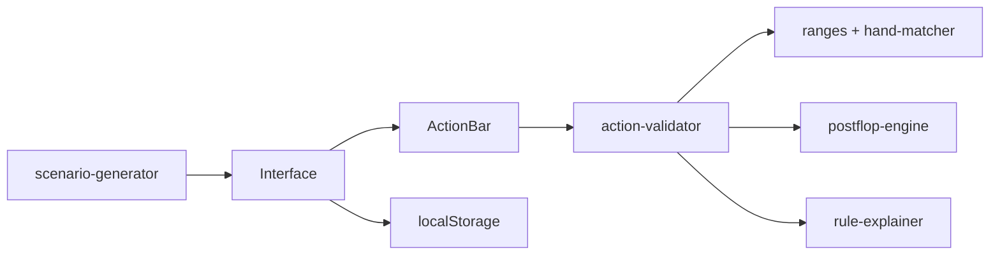

# Spin & Go Trainer

Application web d'entraînement au poker **Spin & Go 3-Max Hyper-Turbo**. Le simulateur génère des situations aléatoires (pré-flop et post-flop), propose des actions contextuelles, valide votre choix selon une stratégie mécanique basée sur les mathématiques, et explique les erreurs en français.

> **État du projet : MVP fonctionnel** — le moteur couvre l'essentiel de la stratégie micro-limites décrite dans le cahier des charges, mais **des imprécisions subsistent** (voir [Limitations connues](#limitations-connues)).

---

## Fonctionnalités

- **Scénarios aléatoires** : pré-flop (~70 %) et post-flop (~30 %, tapis > 15 BB)
- **Formats** : 3-Max et Heads-Up (fusion BTN/SB en HU)
- **Zones de tapis** : verte (> 15 BB), jaune (10–15 BB), rouge (< 10 BB)
- **Validation mécanique** : ranges pré-flop, outs, cotes du pot, C-bet, value bet, fold air
- **Actions filtrées** : seules les actions légales sont proposées (ex. face à un tapis → Fold / Call uniquement)
- **Historique par street** : Pré-flop → Flop → Turn, avec phases passées atténuées
- **Explications pédagogiques** en cas d'erreur
- **Stats locales** : score, série, précision par zone (localStorage)

---

## Stack technique

| Couche | Technologie |
|--------|-------------|
| Framework | [Next.js 16](https://nextjs.org/) (App Router) |
| UI | React 19, Tailwind CSS 4, [shadcn/ui](https://ui.shadcn.com/) |
| Moteur poker | TypeScript pur (`src/lib/poker/`) |
| Tests | [Vitest](https://vitest.dev/) — 74 tests |
| Persistance | localStorage |

---

## Démarrage rapide

```bash
# Cloner et installer
npm install

# Lancer en développement
npm run dev
# → http://localhost:3000

# Tests unitaires
npm test

# Tests en mode watch
npm run test:watch

# Build production
npm run build
npm start

# Lint
npm run lint
```

---

## Architecture

```
src/
├── app/                    # Pages Next.js
├── components/             # UI (ScenarioView, ActionBar, etc.)
├── hooks/                  # useTrainerStats
└── lib/
    ├── poker/              # Moteur poker (pur, testable)
    │   ├── hand-matcher.ts       # Parse KJs, T8o+, 22-77…
    │   ├── deck.ts               # Paquet 52 cartes sans doublons
    │   ├── effective-position.ts # BTN → SB en HU
    │   ├── stack-zone.ts         # Vert / jaune / rouge
    │   ├── ranges/               # Tables de ranges pré-flop
    │   ├── available-actions.ts  # Matrice actions légales
    │   ├── action-validator.ts   # Validation + explications
    │   ├── scenario-generator.ts # Génération aléatoire
    │   ├── pot-calculator.ts     # Calcul du pot pré-flop
    │   ├── action-history.ts     # Formatage historique par street
    │   └── postflop/             # Outs, cotes, board analyzer
    └── stats/                # Persistance localStorage

tests/poker/                # Suite de tests Vitest
```

### Flux d'une partie



---

## Stratégie implémentée

### Lexique des mains

| Notation | Signification |
|----------|---------------|
| `s` | Suited (même couleur) |
| `o` | Offsuit |
| `+` | Main indiquée et toutes les supérieures (1ère carte fixe) |
| `22-77` | Plage de paires |

Exemples : `T8o+` → T8o, T9o · `88+` → 88, 99, TT… · `A2o+` → A2o…AKo

### Zones de tapis

| Zone | Tapis | Stratégie |
|------|-------|-----------|
| Verte | > 15 BB | Jeu post-flop autorisé, relances standard |
| Jaune | 10–15 BB | Push or Fold si premier à parler |
| Rouge | < 10 BB | Push or Fold strict |

**Priorités du moteur** (seuils consolidés) :
1. ≤ 10 BB → ranges Push or Fold
2. ≤ 12 BB, premier à parler BTN/SB → push élargi
3. 11–25 BB → ranges standard (section verte)
4. Post-flop généré uniquement si tapis > 15 BB

### Pré-flop

Ranges complètes pour :
- **BTN** open 2 BB (3-max)
- **SB** : vs fold BTN, vs relance BTN, vs limp BTN
- **BB** : vs relance, vs limp (isolate ou check)
- **Push or Fold** ≤ 10 BB (BTN, SB, défense BB vs tapis)
- **HU** : BTN affiché = SB effectif pour les ranges

### Post-flop (zone verte uniquement)

| Situation | Action attendue |
|-----------|-----------------|
| Air / hauteur faible, vilain mise | Fold |
| Tirage, cotes favorables | Call |
| Tirage, cotes défavorables | Fold |
| Main forte | Bet ~50 % pot |
| Agresseur pré-flop, board sec, vilain check | C-bet 1/3–1/2 pot |
| Top pair kicker faible sur board dangereux | Marginal → Fold face à mise |

**Règle des outs** : flop × 4, turn × 2. Call si équité > cote du pot.

### Profil adverse

Les scénarios simulent des **Calling Stations** micro-limites : ils paient trop, ne se couchent pas facilement avec une paire, bluffent peu.

---

## Interface

```
┌─────────────────────────────────────────┐
│  Stats : score, série, précision/zone   │
├─────────────────────────────────────────┤
│  Zone · Position · Tapis · Street       │
│  Cartes héros + board + pot             │
│  Historique par phase (Pré-flop/Flop/Turn)│
├─────────────────────────────────────────┤
│  [Fold] [Call] [Raise] … (filtrées)     │
├─────────────────────────────────────────┤
│  Feedback + explication pédagogique     │
│  [Prochain scénario]                    │
└─────────────────────────────────────────┘
```

---

## Tests

```bash
npm test
```

Couverture principale du moteur :

| Fichier | Sujet |
|---------|-------|
| `hand-matcher.test.ts` | Parsing et matching des ranges |
| `deck.test.ts` | Unicité des 52 cartes |
| `effective-position.test.ts` | Fusion BTN/SB en HU |
| `stack-zone.test.ts` | Priorités de zones |
| `available-actions.test.ts` | Matrice actions légales |
| `action-validator.test.ts` | Validation pré-flop |
| `postflop-facing-bet.test.ts` | Pas de Bet face à un Bet |
| `bug-56o-on-paired-board.test.ts` | Faux outs corrigés |
| `hu-bb-vs-raise.test.ts` | BB vs relance en HU |
| `scenario-generator.test.ts` | Cohérence ranges + historique turn |
| `action-history.test.ts` | Formatage par street |

---

## Limitations connues

Ce projet est un **outil pédagogique en évolution**. Plusieurs simplifications et imprécisions subsistent :

### Moteur de jeu

- **Seuils de zones** : légères contradictions dans le cahier des charges (10–15 BB vs 11–25 BB) — consolidées par priorité, mais pas parfaites en edge cases
- **Post-flop** : évaluation de main simplifiée (pas de solver GTO) ; classification `marginal` heuristique
- **Outs** : comptage amélioré mais pas exhaustif sur tous les tirages combinés complexes
- **Pot** : calcul pré-flop basé sur blindes fixes (SB 0,5 / BB 1) ; pas de side pots ni relances multiples
- **Générateur** : scénarios post-flop toujours HU, héros agresseur pré-flop ; pas toutes les lignes d'action possibles
- **3-bet / 4-bet** : peu de scénarios multi-relances post-flop
- **Profil adverse** : Calling Station modélisé grossièrement dans le générateur

### Interface

- Pas de mode « révision ciblée » (filtrer par zone/position)
- Pas de compte utilisateur / sync cloud
- Pas de tests E2E navigateur

### Ranges

- Les tables sont codées en dur dans `src/lib/poker/ranges/data.ts`
- Certaines notations de range (`53s+`, etc.) ont une sémantique approximative pour les connecteurs bas

---

## Contribution

Les PRs sont les bienvenues. Priorités suggérées :

1. Affiner le moteur post-flop (force de main, implied odds)
2. Enrichir le générateur (plus de lignes d'action, 3-max post-flop)
3. Mode entraînement ciblé par zone/position
4. Tests E2E (Playwright)

---

## Licence

Projet privé — usage personnel / éducatif.
